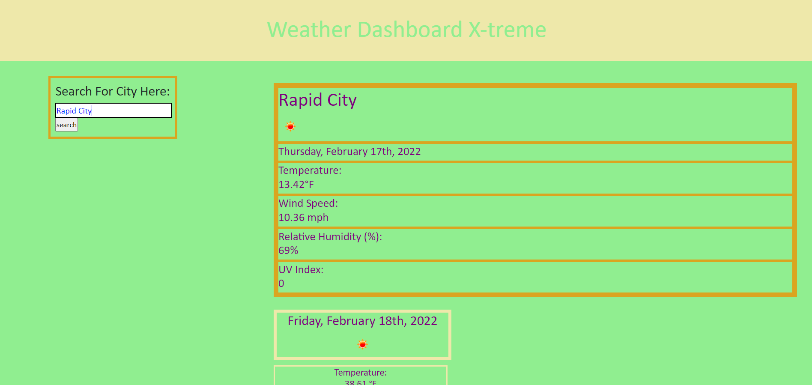
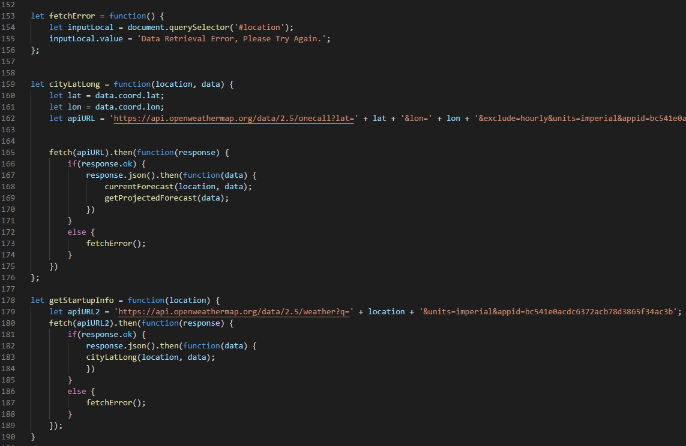

# Weather Dashboard X-reme
  
## Description
A simple application that allows the user to check the current weather, as well as the 5-day forecast, for any city.

## Purpose
Many people in this day and age relay heavily on on our modern ability to accurately and easily predict the weather. Whether you are a family man planning your weekend vacation or an ultra-runner mapping out this afternoon's workout, people everywhere plan their activities based on the weather in many circumstances. Weather Dashboard X-treme allows anyone to easily look up the current and projected weather of any location in the OpenWeather API database, allowing them to simply and safely plan any activities that relay on a particular forecast.

## Table of Contents
- [Built With](#languages)
- [URL](#url)
- [Deployed Application Screenshot](#App)
- [Source Code Screenshot](#Code)
- [Contribution](#contributing)
- [Questions](#questions)

## Built With
* HTML
* CSS
* JavaScript
* [OpenWeather Api Service](https://openweathermap.org/)

## URL
Visit the application [HERE](https://epc318.github.io/Weather-Dashboard-Xtreme/)

## Deployed Application Screenshot

## Source Code Screenshot

## Contributions
- This project was made by Evan Carlson and contains references and material learned in the University of Minnesota Web Dev Bootcamp.
- This project also uses live data from the [OpenWeather Api Service](https://openweathermap.org/)

No Outside Contributions are being accepted at this time.

## Questions
If you have any questions on this application, feel free to reach me through my GitHub profile [epc318](https://github.com/epc318) or [E-mail](carl4917@umn.edu):

### ©️2022 Weather Warriors XTREME, LLC.